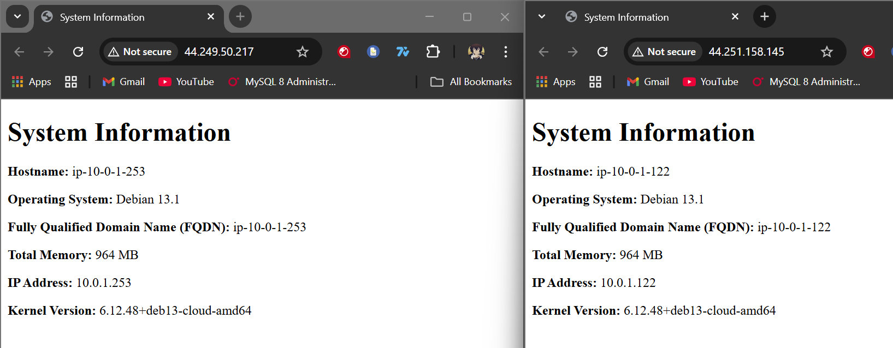

# ACIT4640-Lab6

## Task 0 - Prerequisites

For this lab, you need to make sure that Terraform and Ansibled have been installed and you have configured the AWS CLI in your environment. Then you will need to git clone the starter code repository as well - <https://gitlab.com/cit_4640/intro-to-ansible-lab-files.git>

## Task 1 - SSH Keys

In this lab we will need to generate SSH keys and import the public key onto our EC2 instance that terraform will create. Ansible will then use our private key to connect to the EC2 instance and run different commands. In this case it includes installing nginx, moving files to the correct location, reloading and enabling the service and more.

To generate the SSH keys we will be using for the lab we can use the following:

```bash
ssh-keygen -t ed25519 -C "your_email@example.com" -f ~/.ssh/aws
```

Now that our SSH keys have been generate with `ssh-keygen`, we need to import our public key onto our aws account and we can do this by running the provided script files. Assuming you are in the cloned repository folder, this can be done by running the following:

```bash
# Change into the scripts directory
cd scripts/

# Run the import_lab_key script file
./import_lab_key ~/.ssh/aws.pub
```

## Task 2 - Terraform

Now that we have created and import our public key, we now want to create our EC2 instances using Terraform. First we will need to change directories to our terraform directory:

```bash
cd ../terraform
```

Now the main.tf file has already been provided for us but there are still some commands we need to run to get terraform up and running

### Task 2.1 - Terraform init

```bash
terraform init
```

This command will download and install the AWS provider plugin specified in the configuration. This must be run before any other Terraform commands.

### Task 2.2 - Formating Terraform Files

```bash
terraform fmt
```

This will automatically format Terraform configuration files and ensures consistent formatting across the project.

### Task 2.3 - Validating our Configuration

```bash
terraform validate
```

This will validate the Terraform configuration files for syntax errors and internal consistency. This checks that the configuration is valid before planning or applying.

### Task 2.4 - Preview our Changes

```bash
terraform plan
```

This will create an execution plan showing what resources Terraform will create, modify, or destroy. This is a dry-run that doesn't make any actual changes to infrastructure.

### Task 2.5 - Apply our Configuration

```bash
terraform apply
```

This will create the infrastructure defined in the Terraform configuration. This will:

- Create a VPC with subnet and internet gateway
- Configure security groups (allowing SSH on port 22 and HTTP on port 80)
- Launch 2 Debian EC2 instances
- Output the public IP addresses and DNS names

Type yes when prompted to confirm the action.

Save the IP addresses from the output - you'll need them for the next step.

## Task 3 - Ansible

Now we should have 2 ec2 instances running thanks to terraform and you can double check this in your aws ec2 dashboard on your account.

In the starter code we cloned from the repo, there's a directory called ansible and the one we will be working in going forward so we can change into that directory with `cd ../ansible`.

Using the IP addresses we saved from the terraform output, we want to edit the `inventory/hosts.yml` file and replace the placeholder IP addresses with the actual IP addresses from the Terraform output:

```yml
all:
  children:
    web:
      hosts:
        server-one:
          ansible_host: <IP_ADDRESS_FROM_TERRAFORM_OUTPUT_1>
        server-two:
          ansible_host: <IP_ADDRESS_FROM_TERRAFORM_OUTPUT_2>
```

### Task 3.1 - Testing Connectivity

Now that we have added the public IP addresses of our ec2 instances to our hosts.yml file, we want to test our connectivity and this can be done with the following ansible command:

```bash
ansible all -m ping
```

This will test connectivity to all hosts in the inventory using Ansible's ping module. This verifies that Ansible can successfully SSH into the EC2 instances. You should see "SUCCESS" and "pong" responses from both servers.

### Task 3.2 - Check Playbook Syntax

The next thing we need to do is edit our playbook.yml file as this is where we will specify what ansible will do once it connects to our EC2 instance. Assuming you have already done this, we can check the syntax of the playbook.yml file with the following:

```bash
ansible-playbook --syntax-check playbook.yml
```

This will validate the Ansible playbook for syntax errors without executing any tasks. This helps catch configuration errors before running the playbook.

### Task 3.3 - Running the Playbook

Assuming you ran into no errors when checking the syntax of the playbook.yml file we can run the following command:

```bash
ansible-playbook playbook.yml
```

This executes the playbook to configure the web servers. Based on the configuration we set up, this will:

- Install nginx on both servers
- Create the /web/html directory structure
- Copy the nginx configuration file
- Create a symbolic link to enable the nginx site
- Generate an index.html file from a Jinja2 template with system information
- Reload and enable the nginx service

Assuming all went well, you should see your nginx page at http://(your-public-ip-address)

## Task 4 - Cleanup

Now some of the resources we created may cost us money so we want to make sure we remove everything so we don't leave anything running and forget about it.

### Task 4.1 - Remove SSH key from AWS

First we can remove our public key from aws with the provided `delete_lab_key` script file with the following:

```bash
# Assuming your in the project root folder
./scripts/delete_lab_key
```

This will remove the 4640-wk7-key from your AWS account.

### Task 4.2 - Destroy AWS Resources

Navigate to the terraform directory and destroy all resources:

```bash
cd ../terraform
terraform destroy
```

This will destroy all AWS resources created by Terraform (EC2 instances, VPC, subnets, security groups, etc.). Type yes when prompted to confirm deletion.

## Screenshots of HTML page


